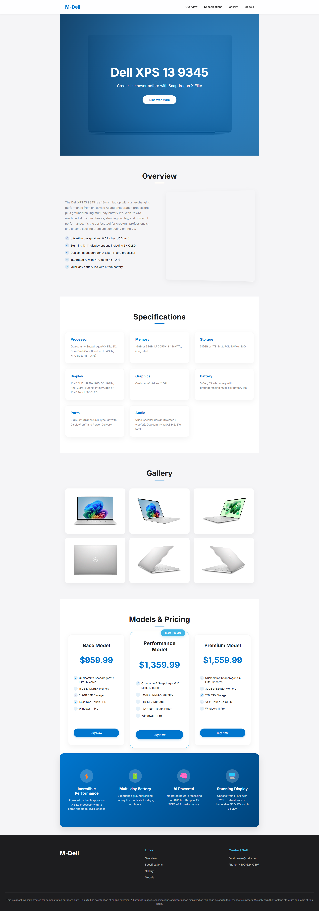

# M-Dell: Dell XPS 13 9345 Premium Laptop website

## Information
[NTI X Hub AI] Hub GenAI for Future Founders

Week 1 - Exercise 1.1

Name: Hoang Tran Nhat Minh

GitHub repository: https://github.com/htnminh/simple-product-website

## Preview
Captured with [GoFullPage - Full Page Screen Capture](https://chromewebstore.google.com/detail/gofullpage-full-page-scre/fdpohaocaechififmbbbbbknoalclacl).



## Prompts
GitHub Copilot (Agent mode) with Claude 3.7 Sonnet.
```
create a simple website to display information about a laptop.
```
```
rename the product to: "Dell XPS 13 9345".

reference the correct information from this site: "https://www.dell.com/en-us/shop/dell-laptops/xps-13-laptop/spd/xps-13-9345-laptop"

make the website look more modern.

and i have added some images in the images directory. use them.
```
```
rename the title of the page and the store name to "M-Dell" (instead of "Dell XPS" and "Dell XPS 13 4395 Premium Laptop").

replace this credit line at the bottom "© 2025 Dell Technologies. All rights reserved." with a few sentences to say that:
1. this is just a mock website
2. this site has no intention of selling anything
3. every property (like images and information) on the page belongs to their respective owner, not us. we just own the frontend structure and logic of the page.
```

## Sources
- https://www.dell.com/en-us/shop/dell-laptops/xps-13-laptop/spd/xps-13-9345-laptop
- https://thinkpro.vn/laptop/dell-xps-13-9345-snapdragon-x-elite?skuId=9576
